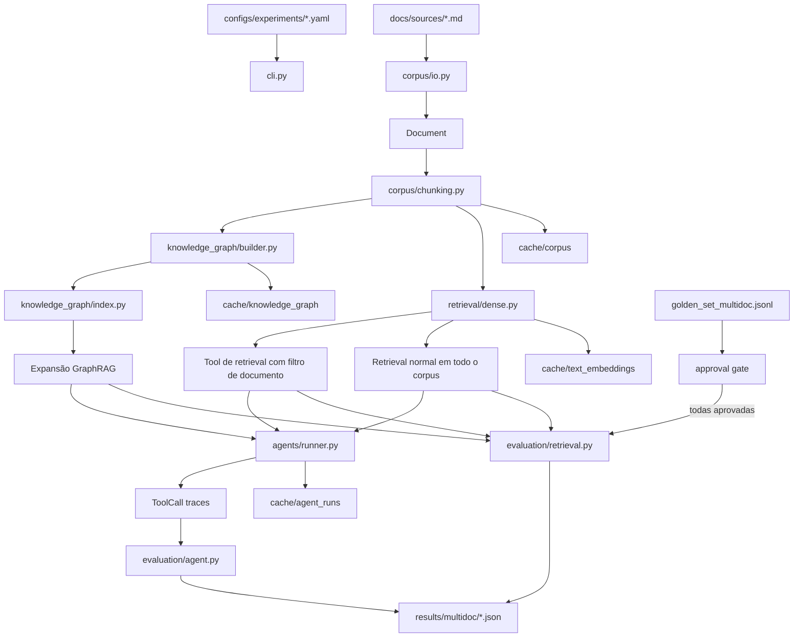

# Groundtruth: guia de arquitetura e código

> **Escopo:** módulos Python, configs, corpus multi-documento, cache, agentes e avaliação.
> **Data:** 2026-09-24
> **Profundidade:** implementação e fluxo completo, do dado ao resultado. Este arquivo explica o código; os resultados experimentais ficam no README.

## TL;DR

O projeto carrega três documentos, transforma o conteúdo em chunks e compara três maneiras de buscar evidências: retrieval normal em todos os documentos, retrieval com filtro de documento por tool e expansão por relações em grafo (GraphRAG). Agentes em condição controlada ou ajustada usam essas buscas por meio de ferramentas. O desenho completo cruza 2 modos × 3 modelos × 3 estratégias (18 células). Os resultados operacionais de 12 células já existem; há YAMLs para as seis células controladas restantes. A matriz de Faithfulness e Answer Relevancy e as limitações estão descritas no [`README.md`](README.md).

## Analogia: uma biblioteca com três coleções

Imagine uma biblioteca que guarda um manual técnico, um perfil profissional e um catálogo de projetos pessoais. Os documentos são as coleções; os **chunks** são páginas menores com endereços; o **retriever** é o bibliotecário que procura páginas; o **grafo** é um índice adicional que registra assuntos relacionados; e o **agente** é a pessoa que escolhe quais balcões consultar antes de responder.

O golden set é o gabarito: contém perguntas, evidências e respostas de referência que uma pessoa revisa. Sem essa revisão, podemos verificar se a evidência existe no texto, mas ainda não podemos afirmar que ela é realmente a melhor resposta para a pergunta.

## Mapa geral

```text
configs/experiments/                 definem corpus, métodos e limites
configs/model_pricing.yaml           preços para estimar custo por tokens
datasets/golden_set_multidoc.jsonl   perguntas, referências e revisão humana
docs/sources/                        três documentos usados como corpus

src/groundtruth/
├── schemas.py                       tipos de dados compartilhados
├── cache.py ─────── costs.py         cache JSON e ledger de custo/tokens
├── corpus/                          leitura, chunking e fingerprints
├── retrieval/                       busca normal, por documento, híbrida e por grafo
├── knowledge_graph/                 extração e expansão de relações
├── agents/                          instruções, tools e traces
├── evaluation/                      métricas e gate
├── experiments/                     validação e execução das rodadas
├── cli.py                           comandos do projeto
└── __main__.py                      entrada `python -m groundtruth`
```

## Como os dados atravessam os módulos



### Uma execução em ordem

1. `cli.py` abre um arquivo de configuração. `experiments/config.py` carrega as queries e barra os comandos de métricas se houver registros não aprovados ou sem referência.
2. `corpus/io.py` lê os documentos. `corpus/chunking.py` separa o texto em janelas de palavras, preserva offsets na fonte e cria IDs estáveis como `projects_0001`.
3. `cache.py` reutiliza os chunks pelo fingerprint do corpus e pelos parâmetros de chunking. `retrieval/dense.py` gera ou lê embeddings pelo par texto/modelo.
4. Se o backend graph foi pedido, `knowledge_graph/builder.py` extrai entidades e relações por lotes, valida a resposta estruturada e grava as extrações/grafo no cache.
5. O experimento executa os retrievers nas mesmas queries. `evaluation/retrieval.py` localiza cada evidência de referência em um chunk e calcula Recall@K, MRR e nDCG.
6. Nos braços com agente, `agents/runner.py` envia as tools ao modelo. Quando o modelo escolhe uma tool, o Python a executa, devolve a saída e aguarda a resposta final.
7. `evaluation/agent.py` resume chamadas, falhas, repetições, custo e latência. Se habilitada, a avaliação RAGAS calcula Faithfulness e Answer Relevancy separadamente.
8. O runner grava JSON em `results/multidoc/`. Ele não escolhe nem cria baseline automaticamente.

## Arquivos da aplicação

### Schemas, cache e custo

| Arquivo | O que faz | Por que está separado |
| --- | --- | --- |
| `src/groundtruth/schemas.py` | Define `Document`, `Chunk`, `QueryCase`, `ScoredChunk`, `ToolCall` e `AgentRun`, com conversão para registros JSON. | Todos os módulos concordam sobre o formato dos dados. Os mesmos registros podem ser gravados no cache e reconstruídos depois. |
| `src/groundtruth/cache.py` | Cria o caminho SHA-256 de uma chave, lê/grava JSON e implementa `get_or_compute`. A gravação é atômica por arquivo temporário e `os.replace`. | O cache compartilhado cuida do armazenamento; cada etapa escolhe quais parâmetros pertencem à própria chave. |
| `src/groundtruth/costs.py` | `UsageLedger` soma chamadas, tokens e custo estimado por modelo usando o YAML de preços. | Torna comparáveis os custos aproximados; não substitui a fatura do provedor. |
| `src/groundtruth/__init__.py` | Marca o pacote principal. | Não implementa lógica de experimento. |
| `src/groundtruth/__main__.py` | Encaminha a execução para `cli.main()`. | Permite executar o pacote como `python -m groundtruth`. |
| `src/groundtruth/cli.py` | Expõe `validate-dataset`, `prepare-corpus`, `evaluate-retrieval`, `evaluate-agents` e `compare-agents`. | Centraliza os comandos e bloqueia a matriz se faltarem células, scores ou passar do gate de Recall. |

Os demais `__init__.py` em `agents/`, `corpus/`, `evaluation/`, `experiments/`, `knowledge_graph/` e `retrieval/` são marcadores de pacote. Não têm comportamento próprio.

### Corpus

| Arquivo | Responsabilidade | Relação com o restante |
| --- | --- | --- |
| `corpus/io.py` | Lê documentos listados no YAML, lê JSONL e escreve JSONL. | Produz `Document` e records consumidos pelo CLI, dataset e cache. |
| `corpus/chunking.py` | Divide documentos em chunks por contagem de palavras, mantém offsets e mapeia trechos de referência. | Retrievers recebem chunks; o avaliador transforma referências textuais em IDs de chunk. |
| `corpus/fingerprint.py` | Calcula hash estável dos IDs e conteúdos dos documentos. | Mudança no texto invalida chunks, grafo e runs de agente cacheados. |

O chunker usa janela deslizante: tamanho e overlap vêm da config. Se uma evidência inteira aparece em mais de um chunk sobreposto, é escolhido um chunk canônico para não contar a cópia como duas evidências relevantes. Esse remapeamento evita penalizar o ranking por duplicatas criadas pelo próprio chunker.

### Retrieval

| Arquivo | Responsabilidade | Tradeoff/limite |
| --- | --- | --- |
| `retrieval/base.py` | Declara o protocolo `retrieve(query, chunks, k, scope_document_ids)`. | Permite que avaliação e agente aceitem implementações diferentes pela mesma interface. |
| `retrieval/dense.py` | `EmbeddingService` obtém embeddings e mantém cache; `DenseRetriever` ordena por similaridade de cosseno. | Busca semântica pode perder termos exatos, siglas ou identificadores. |
| `retrieval/filtered.py` | Restringe os candidatos aos documentos passados em `scope_document_ids`, acionada pela tool do agente. | Sem documento escolhido, não decide sozinho a fonte; é o agente que seleciona o ID. |
| `retrieval/hybrid.py` | Combina score denso e lexical com peso `alpha`. | Implementado para reuso; não está entre os três backends da configuração multi-documento atual. |
| `retrieval/graph.py` | Recupera chunks iniciais pela busca semântica, expande chunks conectados no grafo e combina reciprocal rank com bônus de distância para os chunks expandidos. | O resultado depende da qualidade da extração e dos parâmetros. Nesta amostra, a expansão por grafo ficou abaixo do retrieval normal; os números estão no README. |

Há uma distinção importante no protocolo experimental: no experimento **somente de retrieval**, o filtro recebe `expected_document_ids` como escopo. É uma condição controlada: “se a pessoa já selecionou a fonte, como a busca se sai?”. Isso não mede descoberta automática da fonte. No experimento com agente, o gabarito não é passado como dica; o agente precisa escolher o documento por meio da ferramenta.

### Knowledge graph

| Arquivo | Responsabilidade |
| --- | --- |
| `knowledge_graph/schema.py` | Define nós, arestas e grafo, com serialização JSON. |
| `knowledge_graph/builder.py` | Extrai entidades/relações por chunk com JSON Schema, cria nós de documento/chunk/entidade e arestas `CONTAINS`, `MENTIONS` e relações extraídas. Guarda extração por lote e grafo final em cache. |
| `knowledge_graph/index.py` | Monta lista de adjacência e expande vizinhos com BFS (busca em largura), com limite de saltos e relações permitidas. Para recuperação, as arestas são percorridas nos dois sentidos. |
| `knowledge_graph/cache.py` | Encaminha a criação do grafo à camada geral de cache. |

O grafo é um índice de caminhos entre tópicos, não uma fonte textual nova. A resposta ainda recebe o texto dos chunks originais. Cada relação guarda os chunks que a sustentam para permitir inspeção posterior. Extração pode errar e precisa ser avaliada.

### Agentes

| Arquivo | Responsabilidade |
| --- | --- |
| `agents/protocol.py` | Cria instruções e JSON Schemas de ferramentas para os modos controlled e tuned. |
| `agents/runner.py` | Executa o ciclo Responses API, chama ferramentas localmente, controla passos e chamadas, registra tempo/tokens/erros e cacheia a execução. |
| `agents/trace.py` | Cria assinatura de uma chamada e conta tools únicas, repetidas e com falha. |

No modo **controlled**, as três estratégias expõem `retrieve(query, scope, k)` e compartilham modelo, instrução e limites. No modo **tuned**, retrieval normal oferece `search_all`; o filtro de documento oferece `search_by_document`; GraphRAG oferece `graph_search` e `fetch_source_chunks`. O primeiro ajuda a isolar o retrieval; o segundo compara sistemas completos, incluindo prompt e interface das tools.

O ciclo da tool é explícito:

```python
response = client.responses.create(..., input=messages, tools=tools)
messages.extend(item.model_dump(exclude_none=True) for item in response.output)
tool_result, retrieved_texts = execute_tool(call.name, json.loads(call.arguments))
messages.append({
    "type": "function_call_output",
    "call_id": call.call_id,
    "output": json.dumps(tool_result, ensure_ascii=False),
})
```

O modelo apenas solicita a ferramenta. O programa Python valida e executa a busca e envia o resultado para o próximo passo do modelo. Cada resposta tem limites de chamadas e passos; erros de tools são registrados como falhas, e uma exceção da chamada do modelo fica como erro da execução.

### Avaliação

| Arquivo | Responsabilidade |
| --- | --- |
| `evaluation/retrieval.py` | Calcula Recall@K, MRR e nDCG binários, médias gerais e cortes por categoria, dificuldade e tipo de pergunta. |
| `evaluation/agent.py` | Resume chamadas, erros, repetições, custo/latência média e chama RAGAS sob demanda. Faithfulness e Answer Relevancy têm caches e erros independentes; a falha de uma não apaga o score válido da outra. |
| `evaluation/agent_matrix.py` | Lê os seis resultados de agente, monta as 18 combinações de modo/modelo/estratégia, valida quatro scores por métrica/célula e compara retrieval normal com o baseline. Emite a matriz JSON/Markdown para CI. |
| `evaluation/gate.py` | Implementa a regra genérica de queda máxima de Recall: queda menor ou igual ao limite passa; queda maior falha. |

RAGAS é importado apenas quando a avaliação de geração é pedida. Scores individuais podem ser reutilizados pelo cache com chave baseada em query, resposta, contextos, modelo avaliador e versão das métricas. O custo do avaliador é separado do custo por resposta do agente. O baseline antigo `baselines/retrieval_v1.json` pertence ao handbook original e não deve ser usado para o corpus novo. A referência de retrieval normal da primeira rodada aprovada está em `baselines/multidoc_v1.json`.

### Experimentos

| Arquivo | Responsabilidade |
| --- | --- |
| `experiments/config.py` | Carrega YAML/JSONL, verifica IDs de query únicos e bloqueia a coleta se houver query pendente ou sem referência. Também valida se referências aparecem nos chunks e se documentos esperados existem. |
| `experiments/runner.py` | Carrega/prepara corpus, instancia embedding/retrievers, executa queries ou agentes, agrega resultados e grava JSON em `results/multidoc/`. Importar o módulo não inicia chamadas; as APIs só são chamadas pelos comandos de execução. |

## Configurações, dataset e fontes

| Arquivo | O que controla |
| --- | --- |
| `configs/experiments/retrieval_controlled.yaml` | Três fontes, chunking, modelo de embedding, top-k, backends e métricas de retrieval. |
| `configs/experiments/agent_controlled.yaml` | Agente com interface compartilhada, modelo e orçamento de tools/steps. |
| `configs/experiments/agent_tuned.yaml` | Prompt e tools específicos de cada estratégia e amostra comum de avaliação de geração. |
| `configs/experiments/agent_model_gpt4o_mini_controlled.yaml` | Condição controlada com GPT-4o-mini, para completar a matriz de modelos. |
| `configs/experiments/agent_model_gpt6_luna_controlled.yaml` | Condição controlada com GPT-6 Luna em esforço baixo. |
| `configs/experiments/agent_model_gpt4o_mini.yaml` | Repete as três estratégias de agente com GPT-4o-mini. |
| `configs/experiments/agent_model_gpt6_luna.yaml` | Repete as três estratégias com GPT-6 Luna em esforço baixo. |
| `configs/model_pricing.yaml` | Preços por milhão de tokens usados para estimar gastos; revisar antes de rodadas futuras. |
| `datasets/golden_set_multidoc.jsonl` | 18 queries aprovadas, dificuldade, tipo, documentos, trechos de referência e resposta de referência. |
| `docs/sources/ai_engineering.md` | Handbook técnico original usado também pelo benchmark anterior. |
| `docs/sources/pedro_castanheira.md` | Perfil profissional derivado do currículo; não lista nomes de projetos da empresa. |
| `docs/sources/projects.md` | Somente projetos pessoais derivados do currículo: Cast Review, Cast Code, Tracecast e Cast Skills. Distingue itens em desenvolvimento de roadmap planejado. |
| `docs/design/experiment.md` | Hipótese, condições, métricas e limitações do desenho experimental. |

As referências são trechos textuais da fonte. O validador pode confirmar que o trecho existe, mas só a revisão humana confirma que a pergunta e o gabarito estão semanticamente corretos.

## Cache e custos

`cache.py` cuida de hash/JSON. Os módulos montam chaves específicas:

- `cache/corpus/`: fingerprint dos documentos, tamanho, overlap e versão do chunker;
- `cache/text_embeddings/`: texto e modelo. Embeddings de query incluem também o escopo do experimento/backend, para uma condição não aquecer o cache da outra;
- `cache/knowledge_graph/`: corpus, chunking, modelo extrator e versão do prompt;
- `cache/agent_runs/<experimento>/`: query, backend, fingerprint do índice, modo, modelo, versão do prompt/schema, esforço de raciocínio e limites;
- `cache/generation_eval/`: query, hash da resposta/contextos, modelo avaliador, versão de RAGAS e nome da métrica; cada score é recuperado/salvo independentemente;
- `cache/reranker/`: namespace reservado ao pipeline antigo.

Os chunks atuais do corpus multi-documento são derivados localmente; se mudar uma fonte, seu fingerprint muda e o cache gera chunks novos. Embeddings são outro artefato: uma mudança no texto leva a novas chaves e só os gera quando o experimento precisar deles. Resultados finais não ficam no cache; vão para `results/multidoc/`.

O custo mostrado é estimado a partir dos tokens retornados pela API e da tabela versionada. Custos de indexação/grafo aparecem como setup; custo por resposta inclui chamadas do agente e embeddings de query realizados durante a resposta. Em uma repetição cacheada, o ledger não soma uso já ocorrido; o registro da resposta preserva custo e latência originais para manter o relatório por resposta comparável. Cache quente muda o gasto efetivo da nova rodada.

## Arquivos antigos e novos do repositório

| Arquivo | Papel |
| --- | --- |
| `main.py` | Pipeline legado do benchmark de um documento, com resultados e baseline já produzidos. |
| `generation_eval.py` | Avaliação de geração antiga, separada do agente novo. |
| `test_retrieval.py` | Testes do exercício antigo; alguns cenários podem chamar a API. |
| `golden_set.jsonl`, `chunks.jsonl`, `baselines/retrieval_v1.json`, `results/*.json` | Artefatos do benchmark original. Não misturar com `datasets/golden_set_multidoc.jsonl` e `results/multidoc/`. |
| `pyproject.toml` | Metadados e instalação do layout `src/`, extras `dev`/`evaluation`, entry point e configuração do pytest. |
| `requirements.txt` | Lista de dependências compatível com o setup existente. Para instalar o pacote novo, usar o comando de `pyproject.toml`. |
| `tests/test_multidoc_core.py` | Testes locais sem API para cache, métricas, gate, tools, grafo e traces. |
| `.github/workflows/multidoc-validation.yml` | CI em duas partes: validação offline e comparação completa com API no push/PR interno; salva cache e publica os relatórios como artefato. |
| `.github/workflows/retrieval-eval.yml` | Workflow separado do benchmark original. |
| `.gitignore` | Ignora cache derivado, ambiente Python e arquivos locais de IDE/build. |

## Decisões e limites atuais

| Decisão | Motivo | Consequência |
| --- | --- | --- |
| Avaliação de retrieval e agente usam as mesmas queries. | Mantém o conjunto de perguntas comparável entre estratégias. | Diferença de score ainda depende de qualidade do gabarito e pode variar entre respostas geradas. |
| Agente controlled mantém tool/interface iguais. | Ajuda a atribuir diferenças ao backend. | Não representa o melhor prompt possível para cada estratégia. |
| Agente tuned permite tools/prompts diferentes. | Compara configurações completas. | Não isola causa da melhora ou regressão. |
| Retrieval filtered usa a fonte esperada como escopo controlado. | Mede o retriever quando a origem já foi escolhida. | Não serve como medida de seleção de fonte; agente não recebe essa dica. |
| As 18 queries desta rodada foram aprovadas pelo usuário. | A coleta depende de evidência e revisão explícita. | O conjunto ainda não atinge o requisito original de 100 queries. |
| A primeira referência multi-documento usa retrieval normal sem pista externa (`baselines/multidoc_v1.json`). | É uma referência neutra para o corpus novo. | O workflow atual ainda não compara uma execução nova contra essa referência. |

## Glossário

- **RAG:** geração aumentada por recuperação; busca evidência no corpus antes de redigir a resposta.
- **Corpus:** conjunto de documentos que o sistema pode consultar.
- **Chunk:** trecho menor que funciona como unidade de indexação e recuperação.
- **Embedding:** vetor numérico usado para comparar proximidade semântica entre textos.
- **Retrieval:** busca e ordenação dos chunks candidatos.
- **Recall@K:** fração das evidências de referência encontradas nos primeiros K resultados.
- **MRR:** média do inverso da posição do primeiro resultado relevante.
- **nDCG:** medida de qualidade da ordem, comparada à ordem ideal.
- **Tool:** função que o modelo pode pedir ao aplicativo para executar.
- **Trace:** registro de chamadas, argumentos, duração e sucesso/falha das tools.
- **Fingerprint:** hash que identifica conteúdo e parâmetros de uma versão do corpus/índice.
- **BFS:** busca em largura; percorre primeiro os vizinhos imediatos de um nó e depois os níveis seguintes.
- **Faithfulness:** quanto as afirmações da resposta são sustentadas pelo contexto recuperado.
- **Answer Relevancy:** quanto a resposta atende ao sentido da pergunta.
- **Cache content-addressed:** cache cujo caminho depende de um hash das entradas relevantes.

## Como verificar sem colher métricas

Instale o pacote para que `groundtruth` fique disponível no ambiente:

```bash
python -m pip install -e ".[dev,evaluation]"
python -m pytest tests -q
python -m groundtruth.cli prepare-corpus --config configs/experiments/retrieval_controlled.yaml
python -m groundtruth.cli validate-dataset --config configs/experiments/retrieval_controlled.yaml
```

Os dois primeiros comandos instalam e verificam código local; os outros só leem fontes e preparam chunks/validam evidências. Não geram embeddings e não chamam OpenAI. No corpus atual, a validação deve mostrar 18 queries aprovadas, zero problemas de referência e 21 correspondências query–chunk. Isso confirma que as referências textuais existem; a aprovação humana também está registrada no dataset.

Os comandos `evaluate-retrieval` e `evaluate-agents` são diferentes: eles exigem queries aprovadas e usam APIs. O de agente também executa RAGAS por padrão; `--without-generation-eval` pula apenas Faithfulness e Answer Relevancy.

## Referências

- OpenAI, [Function calling no Responses API](https://developers.openai.com/api/docs/guides/function-calling).
- RAGAS 0.3.9, [Faithfulness](https://docs.ragas.io/en/v0.3.9/concepts/metrics/available_metrics/faithfulness/) e [Answer Relevancy](https://docs.ragas.io/en/latest/concepts/metrics/available_metrics/answer_relevance/).
- Python, [dataclasses](https://docs.python.org/3/library/dataclasses.html), [hashlib](https://docs.python.org/3/library/hashlib.html) e [argparse](https://docs.python.org/3/library/argparse.html).

## Por onde estudar

1. `schemas.py`: entenda os formatos que circulam.
2. `experiments/runner.py`: siga a montagem e ordem da execução.
3. `corpus/chunking.py` e `retrieval/dense.py`: veja como texto vira evidência recuperável.
4. `knowledge_graph/builder.py` e `retrieval/graph.py`: acompanhe o índice de relações.
5. `agents/protocol.py` e `agents/runner.py`: estude como o modelo escolhe e usa tools.
6. `evaluation/`: conecte cada saída a uma métrica e suas limitações.
7. Antes de rodar avaliações, revise query, referência, documentos e evidências no JSONL; aprove somente itens que você conferiu.
